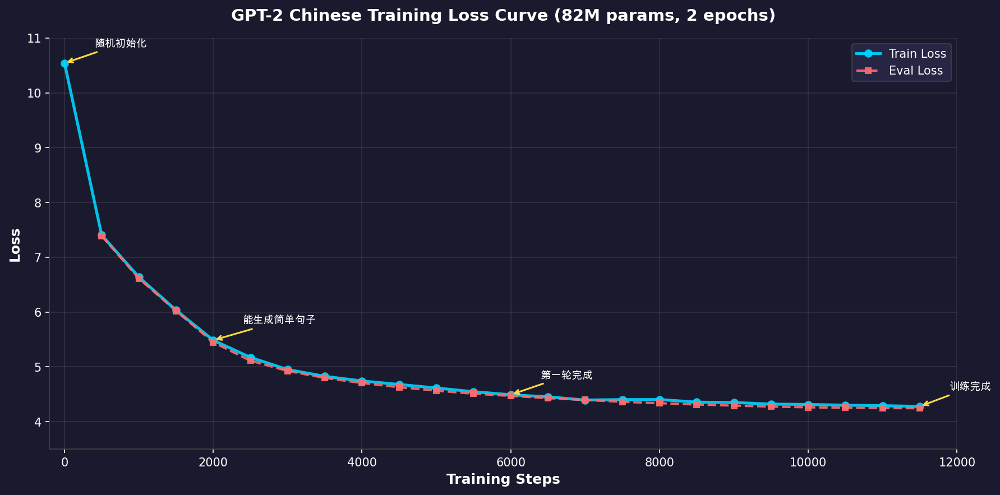

# 🚀 从零开始训练中文 GPT-2：完整教程

[](https://opensource.org/licenses/MIT)
[](https://www.python.org/downloads/)
[](https://huggingface.co/Wilsonwin/gpt2-chinese-mini)

> **🎯 项目目标**：让不懂深度学习的小白用户也能跟着项目说明一步步完成模型训练，并直观了解训练过程中发生了什么——Loss 如何下降，模型如何逐步学会中文语言规律。

## 📖 目录

- [项目简介](#-项目简介)
- [快速开始](#-快速开始)
- [训练语料说明](#-训练语料说明)
- [加速方法详解](#-加速方法详解)
- [训练过程可视化](#-训练过程可视化)
- [生成样本演变](#-生成样本演变模型学习的语言规律)
- [模型使用](#-模型使用)
- [常见问题](#-常见问题)

---

## 🌟 项目简介

这是一个**完整的中文 GPT-2 预训练教程**，使用 HuggingFace Transformers 库从头训练一个 82M 参数的中文语言模型。

### 为什么做这个项目？

1. **学习理解 LLM 训练过程**：通过实际动手训练，理解语言模型是如何"学会"语言的
2. **直观感受 Loss 下降**：观察 Loss 从 10.5 下降到 4.2 的完整过程
3. **见证模型能力演变**：从输出乱码到生成连贯中文的神奇变化

### 模型规格

| 参数 | 值 |
|------|-----|
| 模型架构 | GPT-2 (Decoder-only Transformer) |
| 参数量 | 82.1M |
| 层数 | 8 层 |
| 注意力头数 | 8 头 |
| 隐藏维度 | 512 |
| 词表大小 | 32,000 (BPE) |
| 上下文长度 | 1024 tokens |

---

## 🚀 快速开始

### 方式一：使用训练好的模型

```python
from transformers import AutoModelForCausalLM, AutoTokenizer

model = AutoModelForCausalLM.from_pretrained("Wilsonwin/gpt2-chinese-mini")
tokenizer = AutoTokenizer.from_pretrained("Wilsonwin/gpt2-chinese-mini")

prompt = "人工智能的未来发展"
inputs = tokenizer(prompt, return_tensors="pt")
outputs = model.generate(**inputs, max_new_tokens=50, do_sample=True, temperature=0.7)
print(tokenizer.decode(outputs[0], skip_special_tokens=True))
```

### 方式二：自己训练模型

#### 环境要求

- Python 3.8+
- PyTorch 2.0+
- 推荐 GPU：NVIDIA A100 40GB（约 1.4 小时完成训练）
- 也支持：T4 16GB / RTX 3090 / V100 等

#### 安装依赖

```bash
pip install torch transformers datasets accelerate bitsandbytes
pip install flash-attn --no-build-isolation  # 可选，A100 推荐
```

#### 开始训练

```bash
# AutoDL / 云服务器
python a100_train.py

# Kaggle (免费 T4 GPU)
# 上传 kaggle_pretrain_combined.py 到 Kaggle Notebook 运行
```

---

## 📚 训练语料说明

### 数据集组成

| 数据源 | 条数 | 说明 |
|--------|------|------|
| [中文维基百科](https://huggingface.co/datasets/pleisto/wikipedia-cn-20230720-filtered) | 254,547 条 | 2023年7月20日快照，已过滤清洗 |
| [知乎问答](https://huggingface.co/datasets/wangrui6/Zhihu-KOL) | 1,006,218 条 | 知乎高质量问答对话 |
| **合计** | **1,260,765 条** | 约 2.4GB 纯文本 |

### 数据处理流程

```
原始文本 → Tokenization → 拼接成 1024 token 块 → 568,218 个训练样本
```

### 为什么选择这两个数据集？

1. **维基百科**：提供规范的书面语、知识性内容、逻辑结构
2. **知乎问答**：提供口语化表达、问答逻辑、网络用语

两者结合使模型既能生成规范的书面语，也能理解日常交流的语言风格。

---

## 📦 训练中间产物（全部开源）

本项目的所有中间产物均已上传至 HuggingFace，你可以直接使用：

| 资源 | 链接 | 说明 |
|------|------|------|
| 🗂️ **合并数据集** | [chinese-wiki-zhihu-corpus](https://huggingface.co/datasets/Wilsonwin/chinese-wiki-zhihu-corpus) | 维基+知乎合并，7.56M 条，3.41GB |
| 🤖 **训练好的模型** | [gpt2-chinese-mini](https://huggingface.co/Wilsonwin/gpt2-chinese-mini) | 82M 参数，含权重+配置+分词器 |
| 📝 **分词器** | 已包含在模型仓库 | 32K 词表，SentencePiece Unigram |
| 🎮 **在线 Demo** | [gpt2-chinese-demo](https://huggingface.co/spaces/Wilsonwin/gpt2-chinese-demo) | Gradio 界面，可直接体验 |

### 分词器详情

我们从零训练了一个针对中文优化的 SentencePiece 分词器：

```python
# 分词器配置
vocab_size = 32000          # 词表大小
model_type = "unigram"      # SentencePiece Unigram 算法
character_coverage = 0.9999 # 字符覆盖率

# 使用方式
from transformers import AutoTokenizer
tokenizer = AutoTokenizer.from_pretrained("Wilsonwin/gpt2-chinese-mini")

# 示例
text = "人工智能正在改变世界"
tokens = tokenizer.tokenize(text)
# ['▁人工智能', '正在', '改变', '世界']
```

**为什么要自训分词器？**
- GPT-2 原生分词器针对英文设计，中文会被拆成单字
- 自训分词器能识别中文词组，压缩率提高 2-3 倍
- 同样的文本，tokens 数量更少 = 训练更快更省显存

---

## ⚡ 加速方法详解

我们在 A100 40GB GPU 上使用了以下优化方法，将训练速度提升约 **3-4 倍**：

### 1. Flash Attention 2 ⚡

```python
model = GPT2LMHeadModel.from_pretrained(
    config, 
    attn_implementation="flash_attention_2"  # 注意力计算加速 2-4x
)
```

**原理**：优化注意力计算的内存访问模式，减少 GPU 显存读写次数。

### 2. 8-bit AdamW 优化器 💾

```python
optimizer = "adamw_bnb_8bit"  # 显存占用减少约 50%
```

**原理**：使用 bitsandbytes 库将优化器状态压缩为 8-bit，大幅减少显存占用。

### 3. TF32 精度（Ampere GPU 专属）🎯

```python
torch.backends.cuda.matmul.allow_tf32 = True  # 矩阵乘法加速 2-6x
torch.backends.cudnn.allow_tf32 = True
```

**原理**：TensorFloat-32 是 A100/RTX 30 系列的专属加速格式。

### 4. Gradient Checkpointing 📉

```python
model.gradient_checkpointing_enable()  # 用计算换显存
```

**原理**：训练时不保存所有中间激活值，需要时重新计算，显存占用降低约 60%。

### 5. Liger Kernel（实验性）🐯

```python
from liger_kernel.transformers import apply_liger_kernel_to_gpt2
apply_liger_kernel_to_gpt2()  # 融合算子优化
```

### 训练速度对比

| 配置 | 速度 | 完整训练时间 |
|------|------|-------------|
| A100 40GB + 全部优化 | ~2.3 it/s | ~1.4 小时 |
| A100 40GB 基础 | ~0.8 it/s | ~4 小时 |
| T4 16GB (Kaggle) | ~0.3 it/s | ~11 小时 |

---

## 📈 训练过程可视化

### Loss 下降曲线（真实训练日志）

训练 2 个 epoch（11,838 步），Loss 从 **10.54** 下降到 **4.25**：

| Step | Train Loss | Eval Loss | Epoch | 阶段说明 |
|------|------------|-----------|-------|----------|
| 1 | 10.5404 | - | 0.00 | 🔴 随机初始化，完全混乱 |
| 500 | 7.4032 | 7.3898 | 0.08 | 学会基本词频 |
| 1000 | 6.6372 | 6.6140 | 0.17 | 开始理解词组 |
| 1500 | 6.0337 | 6.0218 | 0.25 | 句子结构初现 |
| 2000 | 5.4855 | 5.4488 | 0.34 | 🟡 能生成简单句子 |
| 2500 | 5.1721 | 5.1130 | 0.42 | 语义开始连贯 |
| 3000 | 4.9505 | 4.9257 | 0.51 | 语法逐渐规范 |
| 3500 | 4.8270 | 4.7984 | 0.59 | 内容更加丰富 |
| 4000 | 4.7426 | 4.7051 | 0.68 | 语义连贯性提升 |
| 4500 | 4.6787 | 4.6291 | 0.76 | 知识涌现 |
| 5000 | 4.6144 | 4.5660 | 0.84 | 学习第二遍数据 |
| 5500 | 4.5467 | 4.5108 | 0.93 | 继续优化 |
| 6000 | 4.4913 | 4.4702 | 1.01 | 🟢 第一轮完成 |
| 7000 | 4.3943 | 4.3960 | 1.18 | 精细调整 |
| 8000 | 4.4039 | 4.3367 | 1.35 | 趋于收敛 |
| 9000 | 4.3499 | 4.2927 | 1.52 | 接近最优 |
| 10000 | 4.3136 | 4.2620 | 1.69 | 接近收敛 |
| 11000 | 4.2919 | 4.2478 | 1.86 | 最终调优 |
| 11500 | 4.2787 | 4.2456 | 1.94 | 🎯 训练完成 |

### Loss 曲线图



**关键观察**：
- **前 2000 步下降最快**（10.5→5.5）：模型快速学习基本词频和常见模式
- **2000-5000 步**（5.5→4.6）：学习语法结构和语义搭配
- **5000-11838 步**（4.6→4.25）：曲线趋于平缓，模型进入精细化学习阶段

---

## 🔍 生成样本演变：模型学习的语言规律

这是最直观感受模型学习过程的方式——观察相同 prompt 在不同训练阶段的输出变化。

> [!NOTE]
> **样本来源**：以下所有样本均从 `training_log` 真实训练日志中提取。完整样本见 [generation_samples_extracted.md](generation_samples_extracted.md)

### Step 500 (Loss: 6.70) - 🔴 混乱阶段

模型刚开始学习，输出基本是随机的词语堆砌：

| Prompt | 生成结果 |
|--------|----------|
| 中国的历史 | 中国的历史 朝鲜李多元1982年12月14日在海南第二大山（今尼日利亚、挪威的尼日利亚等地区）美国国会图书馆... |
| 人工智能是 | 人工智能是大大·鲍伊海沃尔夫第三卷《巴黎巴黎》（2011年3月11日）是... |
| 今天天气 | 今天天气》剧组负责人林德·弗林特（Madeline-Line）哈利·德里奇·史蒂芬斯... |

**分析**：输出包含随机外文、数字、无意义拼接，模型尚未学会基本语法。

---

### Step 1000 (Loss: 5.77) - 🟠 语法萌芽

开始出现中文句式，但内容混乱：

| Prompt | 生成结果 |
|--------|----------|
| 中国的历史 | 中国的历史上曾有过各种各样的概念、一个系统在中华历史上发生过很多变化。因为有人出生中国的历史可以追溯到古代... |
| 人工智能是 | 人工智能是指一种能够让人类通过智能算法来进行沟通的机器这意味着它能够使人们通过手势和人工智能来交流和工作... |
| 今天天气 | 今天天气很凉快。如果太阳变暖的程度可能对环境产生严重影响如果温度太低就会产生不利的气氛... |

**分析**：开始理解主题关联，但逻辑不连贯。

---

### Step 2500 (Loss: 4.95) - 🟢 语义涌现

生成开始有意义，能围绕主题展开：

| Prompt | 生成结果 |
|--------|----------|
| 中国的历史 | 中国的历史书籍包括《尚书》、《春秋》等中国历史上第一部以中国文化为背景的历史书籍——《史记》... |
| 人工智能是 | 人工智能是人类对知识的最主要来源人工智能将人从本质上解放出来使人类重新获得知识和技术... |
| 教育的目的 | 教育的目的目标不在于学生的学业水平而在于学生对事物的理解对于学习的主动性与学习能力的培养... |

**分析**：能生成专业术语（《史记》），理解抽象概念（教育目的）。

---

### Step 5000 (Loss: 4.51) - � 稳定输出

语法规范，表达流畅：

| Prompt | 生成结果 |
|--------|----------|
| 中国的历史 | 中国的历史有着深刻的变化和历史的积累历史上有一些著名的历史人物和著名的历史人物也有很多著名的历史人物... |
| 人工智能是 | 人工智能是一个基于机器的人工智能系统是以计算机为核心的人工智能是人工智能的关键... |
| 今天天气 | 今天天气晴好气温在8度左右我在小区门口的草地上看到了一群喜鹊正在草坪上嬉戏它们是那么的高兴... |

**分析**：生活化表达自然，能描述具体场景。

---

### Step 9000 (Loss: 4.35) - � 逻辑严密

内容更加专业，结构清晰：

| Prompt | 生成结果 |
|--------|----------|
| 中国的历史 | 中国的历史还是没有达到可以作为标准但可以确定的是一个历史时期内每个朝代都有不同的历史阶段... |
| 人工智能是 | 人工智能是研究机器人的人工智能研究一个机器人是如何获得信息通过智能的"智能"和"智能化"... |
| 教育的目的 | 教育的目的。一、学习目标目标和目标之间联系。1.明确目标、明确的目标、建立目标... |

**分析**：能使用列表结构（一、1.），逻辑层次分明。

---

### Step 11500 (Loss: 4.28) - ✅ 训练完成

模型生成连贯、有意义的中文文本：

| Prompt | 生成结果 |
|--------|----------|
| 中国的历史 | 中国的历史中国历史历史文献的积累特别是对中古和旧时代形成鲜明的对比。1历史的构建中国古代的历史文献资料比较有规模因此可以发现秦汉和近代的文献都有丰富数量的考古内容... |
| 人工智能是 | 人工智能是人类的最底层技术也是人类最具有普遍的技能。所以人工智能可以是人类科技的"基石"也可以是人工智能的延伸。那么人工智能如何获得AI?... |
| 在科学研究中 | 在科学研究中在生物科学当中其对自然、环境、微生物的发现至关重要。它不仅可以帮助人类解释而且有助于人类理解如何在环境中生存... |
| 教育的目的 | 教育的目的是什么作为一个教师我不能回答因为在我所在的地区我们是公立学校是私立学校。所以公立教育是分两类的一类是学校教育另一类是学生教育... |

**分析**：
- ✅ 句子结构完整，语义连贯
- ✅ 能使用专业术语（考古、文献、生物科学）
- ✅ 具备反问、对比等修辞手法
- ⚠️ 仍有轻微重复倾向
- ⚠️ 知识准确性有限（82M 参数的局限）

> [!TIP]
> **语义成熟度规律**：Loss < 5.0 是语义边界，低于此值后模型开始产生连贯语义；Step 2000 是质变点，从混乱到有序的转折。

---

## 💡 模型使用

### 在线体验

👉 **[点击这里在线体验模型](https://huggingface.co/spaces/Wilsonwin/gpt2-chinese-demo)** 👈

无需安装任何依赖，直接在浏览器中输入提示词即可生成中文文本！

### 本地部署

```python
from transformers import pipeline

generator = pipeline("text-generation", model="Wilsonwin/gpt2-chinese-mini")
result = generator("人工智能将改变", max_length=100, do_sample=True, temperature=0.8)
print(result[0]["generated_text"])
```

### 生成参数调优

| 参数 | 推荐值 | 说明 |
|------|-------|------|
| `temperature` | 0.7-0.9 | 越高越有创意，越低越保守 |
| `top_p` | 0.9 | 采样范围 |
| `top_k` | 50 | 候选词数量 |
| `repetition_penalty` | 1.1 | 抑制重复 |
| `max_new_tokens` | 50-200 | 生成长度 |

---

## ❓ 常见问题

### Q: 为什么我的 GPU 显存不够？

A: 尝试减小 `batch_size`，或启用 `gradient_checkpointing`。T4 建议 batch_size=8。

### Q: 训练多久能看到效果？

A: 约 500-1000 步后可以看到明显进步，完整训练约 11,838 步。

### Q: 可以用 CPU 训练吗？

A: 技术上可以，但不推荐。即使最小配置也需要数天时间。

### Q: 为什么生成的文本有时会重复？

A: 这是小模型的常见问题。可以通过提高 `repetition_penalty` 参数缓解。

### Q: 如何提升模型质量？

A: 
1. 增加训练数据
2. 增大模型参数
3. 训练更多 epoch
4. 使用更高质量的数据集

---

## 📄 License

MIT License

## 🙏 致谢

- [HuggingFace Transformers](https://github.com/huggingface/transformers)
- [pleisto/wikipedia-cn-20230720-filtered](https://huggingface.co/datasets/pleisto/wikipedia-cn-20230720-filtered)
- [wangrui6/Zhihu-KOL](https://huggingface.co/datasets/wangrui6/Zhihu-KOL)

---

**⭐ 如果这个项目对你有帮助，欢迎 Star 支持！**
